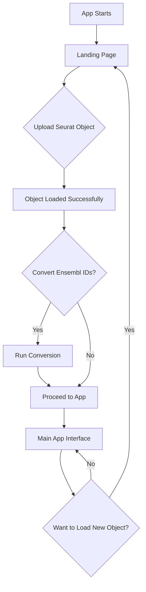

# Implementation Plan: Upload Landing Page

## Goal

Create a dedicated upload landing page that serves as the entry point to the app. Users will upload their Seurat object, optionally convert Ensembl IDs to gene symbols, and then proceed to the main application interface.

## User Flow



## Proposed Changes

### 1. UI Structure Modification

**Current Structure:**
- Single `navbarPage` with all tabs visible immediately
- Upload controls in sidebar of "Visualization" tab

**New Structure:**
- **Conditional rendering** based on whether object is loaded
- **Landing Page** (when `seurat_obj()` is `NULL`):
  - Centered upload interface
  - File input for `.rds` only
  - Species selection (Human/Mouse)
  - Optional Ensembl conversion section
  - **Metadata preview and type specification:**
    - Display all metadata columns with inferred types
    - Allow user to change column type (numeric vs categorical/factor)
    - Preview: cells, features, assays, reductions
  - "Proceed to App" button
- **Main App** (when `seurat_obj()` is not `NULL`):
  - All existing tabs (Visualization, DE, Enrichment, Heatmap)
  - "Load New Data" button in navbar to return to landing page

### 2. Implementation Details

#### `app.R` Changes

**UI Section:**
```r
ui <- fluidPage(
  theme = shinytheme("flatly"),
  
  # Conditional UI based on whether data is loaded
  uiOutput("main_ui")
)
```

**Server Section:**
```r
output$main_ui <- renderUI({
  if (is.null(seurat_obj())) {
    # Landing page
    landing_page_ui()
  } else {
    # Main app interface
    main_app_ui()
  }
})
```

#### New UI Components

**Landing Page UI (`landing_page_ui()`):**
- Clean, centered design
- Large upload area (`.rds` files only)
- Clear instructions
- Object preview after upload:
  - Summary stats (cells, features, assays, reductions)
  - **Metadata table with type inference:**
    - Display all metadata columns
    - Show inferred type (numeric or categorical)
    - Dropdown to change type for each column
    - Auto-detect: numeric if all values are numbers, else categorical
- Conversion options (Ensembl to Symbol)
- Prominent "Proceed" button

**Main App UI (`main_app_ui()`):**
- Existing `navbarPage` structure
- Add "Load New Data" button in navbar
- Remove upload controls from sidebar

### 3. Metadata Type Inference and Specification

**New Feature:** Allow users to specify data types for metadata columns

**Implementation:**
- After object upload, scan all metadata columns
- **Inference logic:**
  - If all non-NA values are numeric → infer as "numeric"
  - Otherwise → infer as "categorical" (factor)
- Display interactive table:
  - Column name | Inferred type | User-specified type (dropdown)
- Apply user selections before proceeding to main app
- Convert columns to factors or numeric based on user choice

**Benefits:**
- Fixes color palette issues (categorical vs continuous)
- Gives user control over data interpretation
- Prevents plotting errors from type mismatches

### 4. Ensembl Conversion Refactoring

**Current Location:** Sidebar in Visualization tab

**New Location:** Landing page only

**Changes:**
- Move conversion logic to landing page
- Show conversion UI only after object is uploaded
- Display conversion results (e.g., "Converted 15,234 genes")
- Remove from main app entirely

### 5. State Management

**Reactive Values:**
- `seurat_obj()` - Current Seurat object (NULL = show landing page)
- `original_obj()` - Backup of original object
- `app_ready()` - Boolean flag for whether to show main app

**Reset Functionality:**
- "Load New Data" button sets `seurat_obj(NULL)`
- Returns user to landing page
- Clears all reactive values

## Files to Modify

### `app.R`
- Refactor UI to use conditional rendering
- Create `landing_page_ui()` function
- Create `main_app_ui()` function
- Move Ensembl conversion to landing page
- Add "Load New Data" button to navbar

### `Dockerfile`
- No changes needed (all modifications in R code)

## Benefits

✅ **Cleaner UX**: Dedicated upload experience  
✅ **Logical Flow**: Upload → Preprocess → Analyze  
✅ **Reduced Clutter**: Main app sidebar is cleaner  
✅ **Better Onboarding**: Clear entry point for new users  
✅ **Flexible**: Easy to add more preprocessing steps to landing page

## Testing Checklist

- [ ] Landing page displays on app start
- [ ] Upload `.rds` file successfully
- [ ] Object metadata preview shows correctly
- [ ] **Metadata type inference works correctly**
- [ ] **User can change column types (numeric ↔ categorical)**
- [ ] **Type changes apply to Seurat object before proceeding**
- [ ] Ensembl conversion works on landing page
- [ ] "Proceed to App" transitions to main interface
- [ ] "Load New Data" returns to landing page
- [ ] All existing functionality works in main app
- [ ] State resets properly when loading new data
- [ ] **Color palettes work correctly with categorical vs numeric metadata**

## Estimated Impact

| Metric | Current | After | Improvement |
|--------|---------|-------|-------------|
| Upload UX | Embedded in sidebar | Dedicated page | **Much cleaner** |
| Ensembl conversion | Always visible | Only when needed | **Reduced clutter** |
| User flow | Unclear entry point | Clear progression | **Better UX** |
| Code organization | Mixed concerns | Separated concerns | **More maintainable** |
